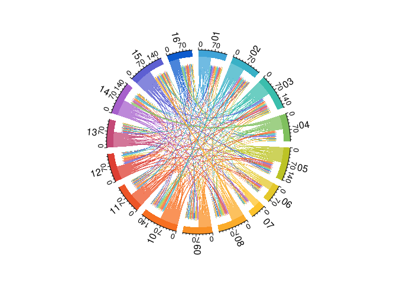
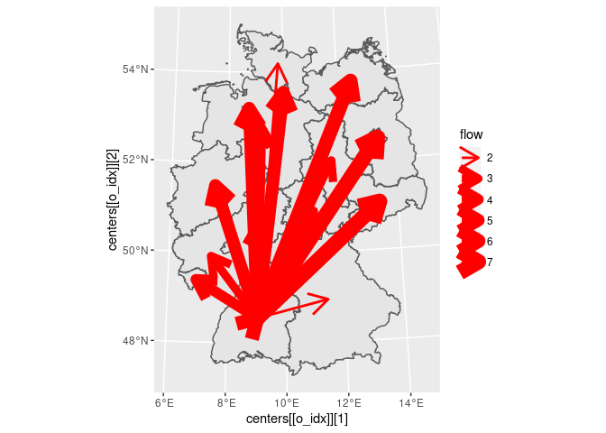
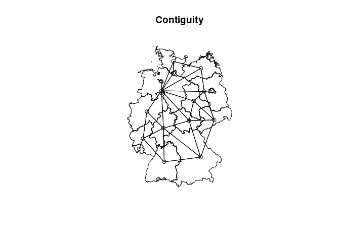

<!-- README.md is generated from README.Rmd. Please edit that file -->

# MigStat

The goal of MigStat is to ease working with Migration Statistics
(Wanderungsstatistik). It’s main functionalities are:

-   prepare data to enable the fitting of spatial origin-destination
    flow models using
    [spflow](https://cran.r-project.org/web/packages/spflow/index.html)
-   easy join of regional characteristics from the
    [inkar](https://www.inkar.de/) data
-   generate random (currently only uniform) moves.
-   make visualizations easy by:
    -   creating maps with arrows to indicate destinations and size of
        migration flows from origin
    -   calculate migration wins and losses for regions
    -   calculate bivariate flows (“Umzüge”) to create [Circular
        Migration Flow
        Plots](https://www.r-bloggers.com/2014/03/circular-migration-flow-plots-in-r/)

## Installation

You can install the development version of MigStat from
[GitHub](https://github.com/) with:

``` r
# install.packages("devtools")
devtools::install_github("KonstantinBASachsen/MigStat")
```

# General Overview

The package evolves around three data sets: - [Migration
Statistics](https://www.forschungsdatenzentrum.de/de/10-21242-12711-2013-00-00-1-1-0)
The example data set gives an idea about the data structure and what
observations can be expected. Unfortunately there are only 200 moves.
For testing of visualizations and models this is not enough in my
opinion. [^1] - [inkar](https://www.inkar.de/) This data has very many
interesting regional characteristics for many years and on different
administrative levels like federal states, districts and
municipalities. -
[shapefile](https://daten.gdz.bkg.bund.de/produkte/vg/vg250-ew_ebenen_1231/2014/vg250-ew_12-31.utm32s.shape.ebenen.zip)
(2014 is not correct, 2013 should be used) This is used to obtain the
geometry information of the regions and the population sizes.

## Examples

Currently the examples assume the user has access to the example
Migration Statistics (Beispieldaten der Wanderungsstatistik). So you can
not actually run the examples. It is merely intended to show the
workings.

### Example load data and join administrative units

``` r

library(MigStat)

ex_dat <- MigStat:::read_examples() ## reads shapefile and example migration statistics
shps <- ex_dat$shps
inkar_csv <- "/home/konstantin/Downloads/inkar_2021.csv"
inkar <- MigStat::read_inkar(inkar_csv)
#> Kennziffer from integer converted to character and leading 0's added 
#>                 to make sure joining to shapefile works
```

Next we want to generate random moves between regions. First we specify
for which regions. Moves can be drawn between origin and destination.
Both can be of one of the following: - federal states (st) - districts
(di) - municipalities (mu)

In this case we generate moves where origin and destination are both
federal states. Currently only uniformly distributed moves are created.
This means every origin-destination pair has the same probability that
somebody moves between them. This is very unrealistic.

``` r

us <- "st" ## "unit_simple" on of c("st", "di", "mu")
dt <- MigStat::n_new_rows(dt = ex_dat$mig, shps = shps, us_o = us, us_d = us, n = 1000) # code should be vectorized, takes unnecessary long to run
```

The data is organized such that every row represents one move:

``` r

dt
#>       EF01 EF02U1 EF02U2 EF02U3 EF02U4 EF02U5 EF03U1 EF03U2 EF03U3 EF03U4
#>    1:   NA     NA     04     NA     NA     NA     NA     10     NA     NA
#>    2:   NA     NA     10     NA     NA     NA     NA     13     NA     NA
#>    3:   NA     NA     11     NA     NA     NA     NA     13     NA     NA
#>    4:   NA     NA     01     NA     NA     NA     NA     16     NA     NA
#>    5:   NA     NA     11     NA     NA     NA     NA     08     NA     NA
#>   ---                                                                    
#>  996:   NA     NA     10     NA     NA     NA     NA     08     NA     NA
#>  997:   NA     NA     09     NA     NA     NA     NA     07     NA     NA
#>  998:   NA     NA     13     NA     NA     NA     NA     08     NA     NA
#>  999:   NA     NA     15     NA     NA     NA     NA     13     NA     NA
#> 1000:   NA     NA     08     NA     NA     NA     NA     07     NA     NA
#>       EF03U5 EF05U3 EF07 EF12U3 EF19 EF20 EF25                state_o
#>    1:     NA     NA   NA     NA   NA   NA   NA               Saarland
#>    2:     NA     NA   NA     NA   NA   NA   NA Mecklenburg-Vorpommern
#>    3:     NA     NA   NA     NA   NA   NA   NA Mecklenburg-Vorpommern
#>    4:     NA     NA   NA     NA   NA   NA   NA              Thüringen
#>    5:     NA     NA   NA     NA   NA   NA   NA      Baden-Württemberg
#>   ---                                                                
#>  996:     NA     NA   NA     NA   NA   NA   NA      Baden-Württemberg
#>  997:     NA     NA   NA     NA   NA   NA   NA        Rheinland-Pfalz
#>  998:     NA     NA   NA     NA   NA   NA   NA      Baden-Württemberg
#>  999:     NA     NA   NA     NA   NA   NA   NA Mecklenburg-Vorpommern
#> 1000:     NA     NA   NA     NA   NA   NA   NA        Rheinland-Pfalz
#>                      state_d
#>    1:                 Bremen
#>    2:               Saarland
#>    3:                 Berlin
#>    4:     Schleswig-Holstein
#>    5:                 Berlin
#>   ---                       
#>  996:               Saarland
#>  997:                 Bayern
#>  998: Mecklenburg-Vorpommern
#>  999:         Sachsen-Anhalt
#> 1000:      Baden-Württemberg
```

We are interested in the number of people moving between regions. The
distance between the centroids of regions is reported as well.

``` r

flows <- get_flows(dt, shps, us = "st")
flows
```

### Create circular migration flow plot

``` r

migest::mig_chord(flows[, 1:3]) ### for this names of regions would be nice
```



### Create Arrow Plot

Now we can create an arrow plot that shows where and how many people
move from origin. First we extract from the shapefile the data we need.

``` r

shp <- MigStat:::clean_shp(shps = shps, us = us) # grabs the correct administrative column and drops unnecessary columns

name <- "Baden-Württemberg" ## name of origin region
dtarrow <- MigStat::get_arrow_data(flows, shp, name)
dtarrow
#>     place flow o_region     xend    yend                  centers
#>  1:    01    6    FALSE 553652.9 6004156 POINT (553652.9 6004156)
#>  2:    02    5    FALSE 567310.6 5933674 POINT (567310.6 5933674)
#>  3:    03    3    FALSE 511363.6 5846065 POINT (511363.6 5846065)
#>  4:    04    3    FALSE 482904.8 5894462 POINT (482904.8 5894462)
#>  5:    05    4    FALSE 399578.3 5703959 POINT (399578.3 5703959)
#>  6:    06    5    FALSE 501846.2 5605263 POINT (501846.2 5605263)
#>  7:    07    2    FALSE 388849.7 5529902 POINT (388849.7 5529902)
#>  8:    08    4     TRUE 503073.9 5376508 POINT (503072.9 5376507)
#>  9:    09    9    FALSE 677821.7 5423448 POINT (677821.7 5423448)
#> 10:    10    2    FALSE 351467.0 5472192   POINT (351467 5472192)
#> 11:    11    6    FALSE 798734.2 5825934 POINT (798734.2 5825934)
#> 12:    12    4    FALSE 799146.5 5822278 POINT (799146.5 5822278)
#> 13:    13    8    FALSE 732862.3 5961981 POINT (732862.3 5961981)
#> 14:    14    6    FALSE 804516.1 5664713 POINT (804516.1 5664713)
#> 15:    15    2    FALSE 685498.7 5765494 POINT (685498.7 5765494)
#> 16:    16    4    FALSE 642505.2 5641040 POINT (642505.2 5641040)
MigStat::arrow_plot(shp, dtarrow) ## draw plot, moves from BaWü to BaWü are a bit hidden
```



## Spatial Origin-Destination Flow Model

### Join covariates

Next we want to model migration flows. First we want to add some
covariates from the inkar data. The inkar data has `length(indic)`
different regional characteristics

``` r

zb <- "2013" ### level of covariates for 2013
indic <- unique(inkar[, Indikator]) ### these are all available covariates
idx <- c(428, 86, 344, 196, 193, 419, 240, 161, 153, 480)
vars <- indic[idx] 
shp <- MigStat::join_inkar_vars(shp = shp, inkar = inkar, vars = vars, us = us, zb = zb)
#> Warning: 'Krankenhäuser mit Regelversorgung' is not available for 2013 and
#> Bundesländer
#> Warning: 'Nahversorgung Grundschulen Anteil der Bev. 1km Radius' is not
#> available for 2013 and Bundesländer
#> Warning: 'Breitbandversorgung mit 1000 Mbit/s in %' is not available for 2013
#> and Bundesländer
#> Warning: 'Erholungsfläche je Einwohner' is not available for 2013 and
#> Bundesländer
#> Warning: 'Männliche Arbeitslose' is not available for 2013 and Bundesländer
```

Now we looked a bit at the data; the data is in the right format and we
joined regional characteristics to be able to easily include covariates
to our model. This is essentially what the package is made for.

The next steps rely on the
[spflow](https://cran.r-project.org/web/packages/spflow/index.html)
package to build and estimate a spatial origin-flow model. This code is
not part of MigStat. It is merely intended to show how one can proceed
with data analysis.

### Create spatial weight matrix

``` r

set_geom <- function(dt, geom_only = T) {
    dtgeom <- sf::st_set_geometry(dt, dt[, geometry])
    if (geom_only == TRUE) {
        dtgeom <- sf::st_geometry(dtgeom)
    }

    return(dtgeom)
}

mid_points <- sf::st_point_on_surface(set_geom(shp))
shp_nb <- list(
    "by_contiguity" = spdep::poly2nb(set_geom(shp)) ##,
##    "by_distance" = spdep::dnearneigh(mid_points,d1 = 0, d2 = 1500), ## 
##    "by_knn" = spdep::knn2nb(spdep::knearneigh(mid_points, 3))
)

plot(set_geom(shp))
plot(shp_nb$by_contiguity, mid_points, add = TRUE)
title("Contiguity") 
```



For efficient estimation of the model, the following data structure is
needed:

``` r

idx <- !(colnames(shp) %in% c("geometry", "GEN"))
shp <- shp[, ..idx]
idx <- vars %in% colnames(shp) ## because not all desired vars could be joined we check if they are indeed part of shp
m_cols <- c("EWZ", vars[idx]) ## columns included in model
shp[,  (m_cols) := lapply(.SD, scale), .SDcols = m_cols]

shp_net <- 
  spflow::sp_network_nodes(
    network_id = "states",
    node_neighborhood = spdep::nb2mat(shp_nb$by_contiguity),
    node_data = shp,
    node_key_column = "AGS")


shp_net_pairs <- spflow::sp_network_pair(
  orig_net_id = "states",
  dest_net_id = "states",
  pair_data = flows,
  orig_key_column = "origin",
  dest_key_column = "destination")

shp_multi_net <- spflow::sp_multi_network(shp_net, shp_net_pairs)
```

[^1]: The data set is actually not really needed. What is needed are the
    column names and some missings here and there. I am not sure if it
    is allowed to share the data structure publicely. I will find out
    and if so, I remove the dependence on the example data and provide a
    function to recreate it.
